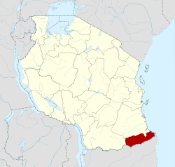
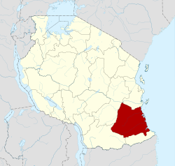
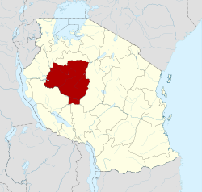
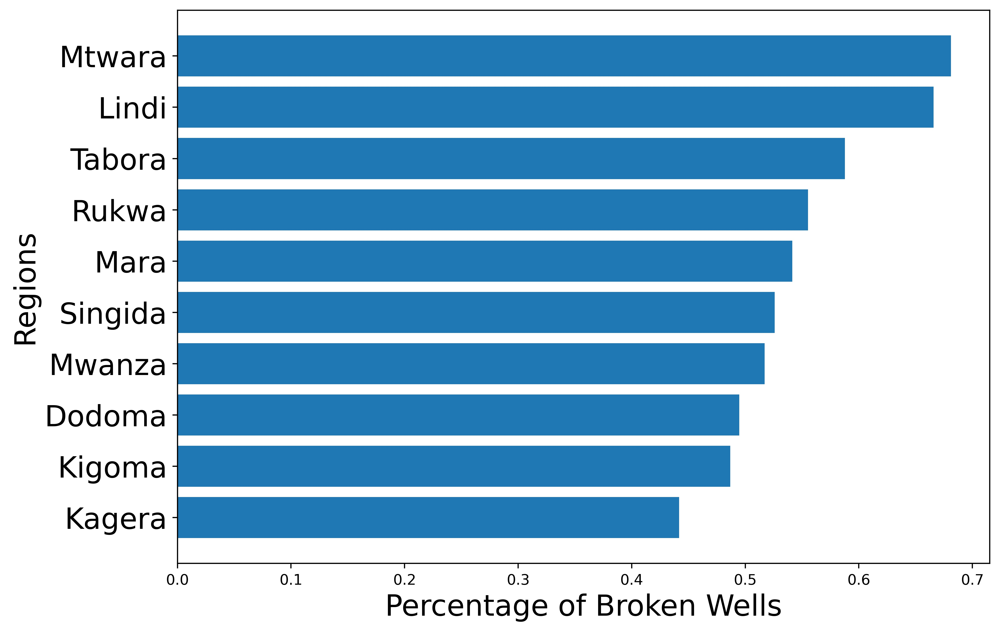

# Phase-3-Project
by Kyongmin So 
<br />
[LinkedIn](https://www.linkedin.com/in/kyongminso//) |
[GitHub](https://github.com/kyongminso) |
[Email](mailto:kyongminso@gmail.com)

# UN Water Well Initiative


## **Overview**


Using a predictive model and other forms of predictive analysis, we aided the United Nations Water Well initiative to Tanzania. Our final model predicts where the broken wells are located to aid the local citizens. This project is to aid the citizens of Tanzania as some of these water pumps are vital for many people and it is the only water source for many communities.


## **Data** 

Our data was retrieved from Driven Data. The wells are categorized with these 3 status: 
- Not working  
- Working but needs repair
- Working

I will be solely focusing on the broken wells as they are my target for this project as we do not need to worry about the working wells.


## **Business Problem**

The UN is doing a humanitarian project in Tanzania and they need to know where the broken wells are located in order to efficiently allocate the resources to repair them for the people of Tanzania. This is absolutely vital as these wells are the only source of water for many communities and villages in the regions. Using my prediction model will help save the United Nations time and money for this crucial project. 

## **Model** 

I approached my project using 3 different modeling techniques to help me find the highest accuracy:


- Logistic Regression 
- Random Forests 
- Gradient Boosting

I also Grid Searched my Logistic Regression and my Random Forests to help me find the best parameters for me to find my accuracy. 

### Logistic Regression
Logistic Regression is used to help better understand the relationship between the dependent variable and all of the independent variables, which was what I was working with. I was just trying to find anything interesting in correlation to the broken wells and see if any of my independent variables has any effect on dependent. 

My score for my Logistic Regression was 76% and using gridsearch, my score was still around the ballpark of 76%.

### Random Forest
---
I chose Random Forest because honestly, it was one of the fastest models to run. It also reduces the risk of overfitting. When you have a lot of decision trees in a random forest, the classifier will not overfit the model because the averages of uncorrelated trees will lower the overall variance.

For my Random Forest Results, I got 78% accuracy, and with my grid search, my accuracy jumped up by 1% to a 79%. **This was my best score.**

### Gradient Boosting 
---
Gradient Boosting was my final model I used.  Gradient Boosting possible next model, when combined with previous models, minimizes the overall prediction error. It is basically decision trees mixed with Logistic regression because it has a gradient descent like logistic regression, but it also has features of a decision tree. The accuracy for Gradient Boosting was 75%. This was the worst model out of the 3 models. 


## **Evaluating the Data** 
---
After finishing all of my models, I wanted to track where the worst hit regions were when it came to the broken wells. My main focus were the wells that were categorized as broken. I need this data for my business question. I need to be able to accurately predict the broken wells. 

The top 3 regions that were hit the hardest according to my predictions were: 
- ### Mtwara



- ### Lindi 


- ### Tabora



The top 10 worst hit regions were: 
- Mtwara           :0.681159
- Lindi            :0.665775
- Tabora           :0.587771
- Rukwa            :0.555300
- Mara             :0.541494
- Singida          :0.525959
- Mwanza           :0.516981
- Dodoma           :0.494810
- Kigoma           :0.486750
- Kagera           :0.441725


Here is the graph reprenting all of the graphs in order. This is based off of the percentage of broken wells. 



## **Recommendations** 
For the recommendation, say we focus specifically on the top 10 regions with the broken wells. Our time and resources are valuable and we need to be able to do this project quick and efficiently.

And specifically, we should be  investing more into Tanzania, The last time the UN specifically provided aid to Tanzania was in 2011 with loan of 90 million dollars. 

## **Next Steps**

So, for the next steps, I would look at correlation between the broken wells and the population density. See if the population affects the broken wells.Especially with the regions hit the most, I would check and see the populations for those regions.

```
├── Overview 
├── Data
├── Business Problem
├── Models
│     ├── Logistic Regression
│     ├── Random Forests
│     └── Gradient Boosting
├── Evaluating the Data    
├── Recommendations
└── Next Steps
```